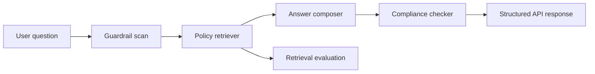

# Mortgage Compliance RAG Agent

Production-style reference project for an AI assistant that answers mortgage policy questions with retrieved citations, compliance checks, guardrails, and API serving.

This project is designed to showcase GenAI engineering skills without requiring paid LLM or vector database accounts. It uses local TF-IDF retrieval by default, clean structured outputs, deterministic rule checks, and a FastAPI interface. The same boundaries can be swapped for OpenAI, Anthropic, Bedrock, Pinecone, FAISS, or LangGraph in production.

## Why This Project Matters

Mortgage and banking workflows need AI systems that are accurate, auditable, and safe. A generic chatbot is not enough. This project demonstrates:

- Retrieval-augmented generation style answers with policy citations
- Compliance validation against domain rules
- Guardrails for prompt injection and unsupported claims
- Evaluation hooks for retrieval quality and answer faithfulness
- API-first deployment with health checks and typed schemas
- CI-ready tests for production engineering discipline

## Architecture



## Features

- **Hybrid-ready retrieval:** Local TF-IDF retriever with metadata filtering and replaceable vector-store boundary.
- **Compliance agent:** Runs deterministic policy checks for income, DTI, document freshness, identity, and auditability.
- **Cited answers:** Every response includes source snippets and document IDs.
- **Safety controls:** Blocks prompt-injection attempts and flags answers with weak evidence.
- **FastAPI service:** `/ask`, `/health`, and `/metrics` endpoints with Pydantic schemas.
- **Evaluation:** Small retrieval eval runner with Recall@K and MRR.
- **Tests:** Unit tests for guardrails, retrieval, compliance checks, and API behavior.

## Quick Start

```bash
python -m venv .venv
source .venv/bin/activate
pip install -e ".[dev]"
uvicorn compliance_agent.api:app --reload
```

Try a query:

```bash
curl -X POST http://127.0.0.1:8000/ask \
  -H "Content-Type: application/json" \
  -d '{"question":"Can we approve a mortgage file when income documents are older than 90 days?"}'
```

Run tests:

```bash
pytest
```

Run retrieval evaluation:

```bash
python -m compliance_agent.evaluation
```

## Example Response

```json
{
  "answer": "The file should not be approved until income documentation is refreshed...",
  "decision": "needs_review",
  "confidence": 0.83,
  "citations": [
    {
      "document_id": "income-verification",
      "title": "Income Verification Policy",
      "snippet": "Income documentation must be dated within 90 days..."
    }
  ],
  "checks": [
    {
      "name": "income_document_freshness",
      "status": "fail",
      "reason": "The question references documents older than 90 days."
    }
  ]
}
```

## Production Extensions

This local implementation is intentionally modular. In production, the same shape can be extended with:

- LangGraph state machine for multi-step compliance workflows
- Pinecone, FAISS, Weaviate, or OpenSearch hybrid retrieval
- OpenAI, Anthropic Claude, or Amazon Bedrock answer generation
- RAGAS or LLM-as-judge evaluation
- MLflow prompt/version tracking
- OpenTelemetry traces and Grafana dashboards
- Terraform modules for AWS ECS/EKS deployment

## Resume Keywords Demonstrated

RAG, Agentic AI, LLMOps, FastAPI, Pydantic, guardrails, hallucination mitigation, retrieval evaluation, mortgage compliance, structured outputs, CI/CD, production-ready ML systems.

